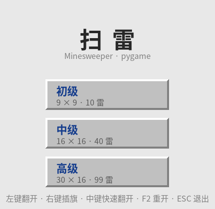
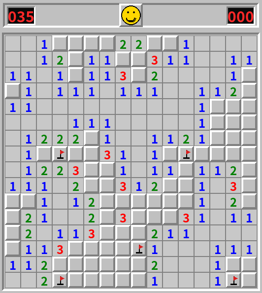
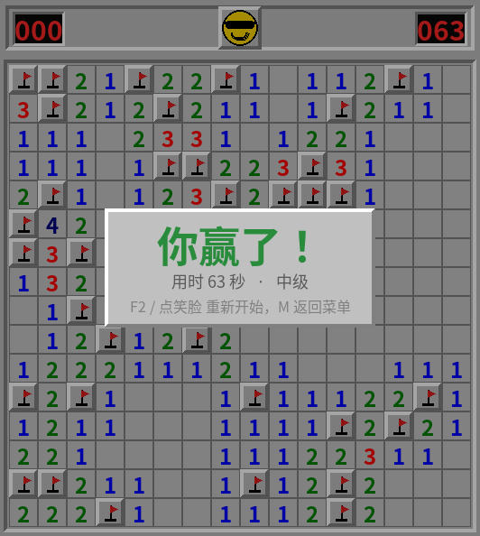
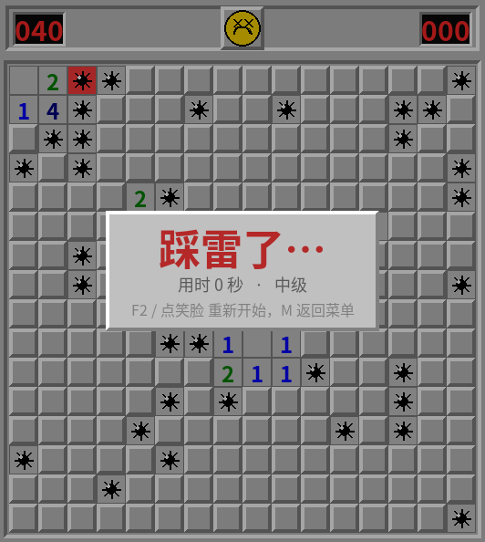

# 扫雷 Minesweeper（pygame）

经典 Windows 风格扫雷，纯 pygame 实现，**零外部素材**——所有图形（斜角按钮、数码管、笑脸、地雷、旗子）均由代码绘制。


## 预览

| 难度菜单（初级窗口下的自适应布局） | 对局中 |
| :---: | :---: |
|  |  |

| 胜利结算 | 失败结算 |
| :---: | :---: |
|  |  |

## 特性

- 三档难度：初级 9×9 / 10 雷、中级 16×16 / 40 雷、高级 30×16 / 99 雷
- 首次点击必安全（点击格及其周围一圈均无雷），且首点数字必为 0，必然开出一片空白区
- 左键翻开 / 右键插旗 / 中键（或左右键同按）在数字格上快速翻开周围
- 剩余雷数计数、计时器、笑脸按钮（按住变惊讶脸，胜利戴墨镜，失败变 X 眼）
- 失败时展示全部地雷、标错的旗打红叉；胜利时自动补满旗并弹出结算面板
- 空白格自动洪水扩散；数字按经典配色（1 蓝 2 绿 3 红 …）
- 中文字体按 Windows / macOS / Linux 常见字体族依次匹配，全都没命中时再遍历系统字体兜底，
  并逐个用字形表校验，不会退化成方框乱码

## 快速开始

```bash
git clone https://github.com/201634924cyh/minesweeper.git
cd minesweeper
```

然后选一种方式启动：

| 平台 | 命令 |
| --- | --- |
| Windows | 双击 `run.bat` |
| macOS / Linux | `sh run.sh` |
| 任意平台手动 | `pip install -r requirements.txt` 然后 `python minesweeper.py` |

启动脚本会自己找 Python、缺 pygame 就自动装（走清华镜像），首次运行不会卡住。

> 没有官方 pygame wheel 的 Python 版本（如 3.14）会自动改装 `pygame-ce` —— 社区分支，API 兼容，装完同样是 `import pygame`。

## 操作

| 按键 | 功能 |
| --- | --- |
| 左键 | 翻开格子 |
| 右键 | 插旗 / 取消旗 |
| 中键（或左右键同按） | 数字格上快速翻开周围（左右同按时，先松开任一键都会触发） |
| F2 / 点击笑脸 | 重新开始 |
| 1 / 2 / 3 | 切换 初级 / 中级 / 高级 |
| M | 返回难度菜单 |
| ESC | 退出 |

## 代码结构

```
minesweeper/
├── minesweeper.py     # 游戏本体：配置、工具、棋盘逻辑、渲染、主循环、无头自测（单文件）
├── selftest.py        # 独立无头自测：菜单几何 + 像素扫描（63 项断言）
├── run.bat            # Windows 启动脚本
├── run.sh             # macOS / Linux 启动脚本
├── requirements.txt   # 依赖（仅 pygame）
├── preview/           # README 用的截图（自测自动重新生成）
├── LICENSE
├── .gitignore
└── .gitattributes
```

单文件内部分层清晰，便于扩展：

- `Board` —— 纯逻辑层：布雷、翻格、标旗、和弦、胜负判定
- `Renderer` —— 绘制层：斜角边框、数码管、笑脸、地雷与旗子
- `Game` —— 主循环：事件分发、计时、难度切换、结算面板
- `smoke_test()` —— 无头自测，见下

## 自测

两套互补的无头自测，都以 SDL dummy 驱动、全部通过时退出码为 0，适合接 CI：

```bash
python minesweeper.py --test    # 内置自测，62 项断言
python selftest.py              # 独立自测脚本，63 项断言
```

合计 **125 项断言**，覆盖：

- **三档难度必胜路径**：逐格翻开全部非雷格，校验判定为胜、翻开数 = 非雷格总数、旗数 = 雷数、无雷格被翻开
- **三档难度必败路径**：踩雷后判定为负、踩中的那颗被标记、其余地雷全部展示、拒绝继续输入
- **首击安全**：三档各 40 次随机首点，保证不踩雷且首点周围一圈无雷
- **每格数字**：逐格比对 `adj` 与实际邻雷数
- **和弦**：旗数不足时不动作；补满旗后翻开其余安全邻格
- **随机对局 400 帧**：`opened` / `flags` 计数与实际盘面始终一致
- **菜单几何**：三档窗口下卡片均在窗口内、互不重叠、不与底部提示重叠、提示文字不被裁切
- **棋盘居中**：三档难度左右与上下留白对称
- **中文字形**：定位到的字体必须真的带中文字形（`metrics()` 非 None）—— 字体回退的回归测试
- **布雷幂等**：`arm()` 重复调用不会叠加布雷

`selftest.py` 另有截图后的**像素扫描**（菜单标题确有文字像素、卡片之间是纯背景色、棋盘出现数字配色、
HUD 数码管是红色、结算面板比棋盘更亮），以及「初级最小窗口下菜单确实启用了压缩布局」的回归锁
—— 菜单是自适应布局，与棋盘共用同一个窗口，没有独立的菜单窗口尺寸。

两套自测都会顺带把 README 用的截图重新生成到 `preview/`。

## 布局说明

窗口宽度下限 360px（初级棋盘只有 288px，会被撑宽），因此棋盘原点按窗口实际尺寸反算居中，
菜单也按窗口高度自适应压缩——初级窗口仅 370px 高，装不下固定间距的原始布局。

字体同理不写死：只列 Windows 字体会让 Linux / macOS 上的中文全变成豆腐块，
所以候选按三大平台排列，并且采用前会用字形表确认真的能画中文。

## 许可

[MIT](LICENSE)
